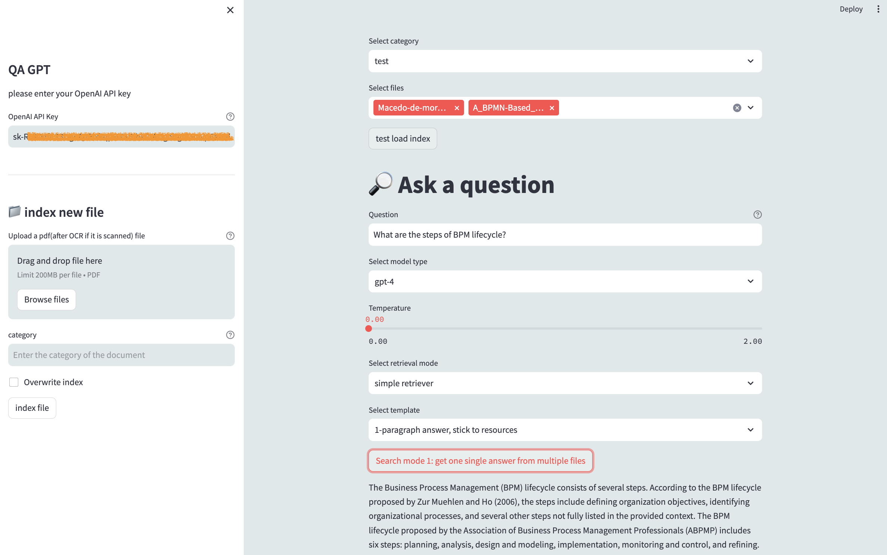

# Project Name

Talk with PDF through ChatGPT.
Based on Langchain and Streamlit.

# Feature

Saved index for PDFs.
Talk to multiple PDFs.
Different levels of detailed answers.

## Installation

Download the whole project and run it locally.

## TODO

Customised prompt templates.

## Bug

index saving can 

## Screenshot

