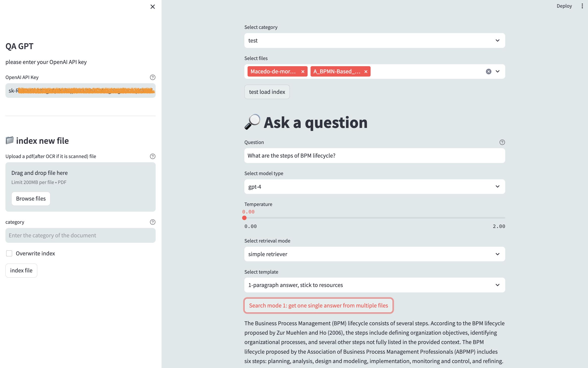

# QA_PDF — Talk to your PDFs

A Streamlit app for question-answering over PDF documents using LangChain, ChromaDB, and OpenAI.

> **Archive note (2026):** This is a September 2023 experiment, pinned to `openai==0.28` and `langchain==0.0.279`. Both libraries have since had breaking API rewrites, so this repo is kept as a reference — not actively maintained. My current work on retrieval and vault-scale RAG lives in [EmptyOS](https://github.com/KevinBean/emptyos-site).



## What it does

- Upload one or more PDFs
- Embed and index them into a local ChromaDB store (index is persisted, so re-opening the app doesn't re-embed)
- Ask questions in natural language; get answers grounded in the indexed documents
- Choose between short, medium, or detailed answer styles via a custom prompt template

## Stack

- **UI** — Streamlit
- **Orchestration** — LangChain (`0.0.x`)
- **Vector store** — ChromaDB (local persistence)
- **Embeddings + LLM** — OpenAI (`text-embedding-ada-002`, `gpt-3.5-turbo`)
- **PDF parsing** — pypdf

## Retrieval approach

The `qa.py` source notes three retrieval strategies, with the app using #3:

1. **Direct similarity search** over the vector store (no retriever wrapper).
2. **Simple retriever** — wrap the vector store as a retriever, fetch top-k relevant chunks.
3. **Contextual compression retriever** — after top-k retrieval, compress each chunk against the question so the final context handed to the LLM is tighter and more on-topic. *This is the method used in the demo.*

## Run it locally

```bash
git clone https://github.com/KevinBean/QA_PDF.git
cd QA_PDF
python -m venv .venv && source .venv/bin/activate   # Windows: .venv\Scripts\activate
pip install -r requirements.txt
export OPENAI_API_KEY=sk-...                        # Windows: set OPENAI_API_KEY=...
streamlit run qa.py
```

The requirements file pins exact versions — needed, since later LangChain and OpenAI SDK releases are incompatible.

## Status

Kept as a public reference for an early LLM/RAG approach. For current work, see [EmptyOS](https://github.com/KevinBean/emptyos-site) — it applies the same ideas (embed, retrieve, compress) at vault scale with a modern stack.

## License

MIT — see [LICENSE](LICENSE).
